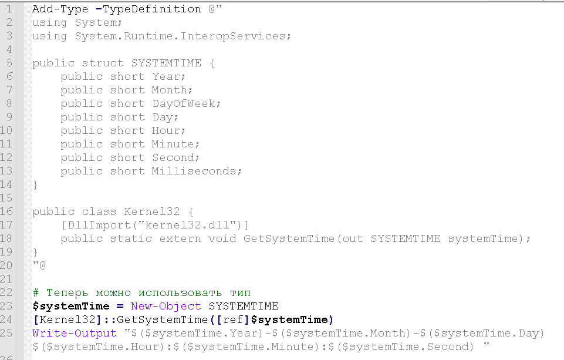

# Инструкция по взаимодействию с Windows API с помощью PowerShell

Рассмотрим основные понятия и определения, а затем перейдем непосредственно к инструкциям.

## Определения

**PowerShell** - это приложение с интерфейсом командной строки, которое представляет собой кроссплатформенную среду  для управления конфигурациями и выполнения скриптов различного назначения, написанных на специально разработанном скриптовом языке под одноименным названием PowerShell.

**Windows API** - это платформа для разработки Windows-приложений на языке C/C++, которые имеют доступ к операционной системе Windows и оборудованию.

**Взаимодействие с Windows API** - использование набора базовых функций и интерфейсов операционной системы Windows для прямого управления её возможностями, а также для выполнения определенных задач, таких как работа с устройствами, файловой системой и других.

## Инструкция
### Запуск PowerShell.

#### Из меню Пуск
1. Нажмите Пуск.
2. В строке поиска введите "powershell".
3. Найдите вариант Windows PowerShell и запустите приложение.

#### Из диалогового окна "Выполнить"
1. Нажмите Win+R
2. В открывшемся диалоговом окне введите "powershell"
3. Нажмите Enter.
   
После запуска PowerShell откроется окно:

### Взаимодействие с Windows API

#### Написание кода на скриптовом языке PowerShell

**Общая последовательность действий:**

1. Объявите класc c помощью ключевого слова **Add-Type**.
2. Объявите внутри класса сигнатуру функции из Windows API.
3. Подключите библиотеку (DLL), из которой эта функция импортируется.
4. После объявления функции вызовите её как обычный .NET-метод.

**Пример:**

Для того, чтобы получить текущее системное время: 

1. Объявите класс с любым названием (в данном примере класс называется **Kernel32**).
2. Объявите сигнатуру функции **GetSystemTime**.
3. Подключите с помощью ключевого слова **DllImport** библиотеку "**kernel32.dll**".
4. Вызовите функцию с помощью команды **[Kernel32]::GetSystemTime([ref]$systemTime)**

Получившийся скрипт можно скопировать в окно PowerShell и нажать Enter. В результате отобразится системное время.

#### Разработка и запуск скрипта PowerShell из файла

Для удобства запуска скрипта можно определить его в файле и затем запустить скрипт на выполнение из файла.

**Общая последовательность действий:**

1. Создайте текстовый файл.
2. Поменяйте расширение файла на .ps1 (является стандартным расширением для PowerShell).
3. Вставьте в файл корректный код на скриптовом языке PowerShell.
4. Запустите PowerShell.
5. Перейдите в директорию, в которой располагается созданный файл, с помощью команды **cd** 
6. Запустите получившийся скрипт с помощью команды .\Имя_файла.ps1

**Пример:**
1. Создайте текстовый файл systime.txt
2. Поменяйте расширение файла на .ps1
3. Вставьте в файл код получения системного времени из примера выше.
4. Запустите PowerShell.
5. Перейдите в директорию, в которой располагается созданный файл, с помощью команды **cd** 
5. Запустите получившийся скрипт с помощью команды .\systime.ps1

## Полезные ссылки

Официальная документация Microsoft о **PowerShell** - https://learn.microsoft.com/ru-ru/powershell/scripting/overview?view=powershell-7.5

Официальная документация Microsoft о **Windows API** - https://learn.microsoft.com/ru-ru/windows/win32/desktop-programming

Политики выполнения PowerShell - https://learn.microsoft.com/ru-ru/powershell/module/microsoft.powershell.core/about/about_execution_policies?view=powershell-7.5
