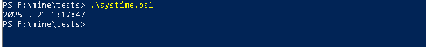

# Инструкция по взаимодействию с Windows API с помощью PowerShell

Рассмотрим основные понятия и определения, а затем перейдем непосредственно к инструкциям.

## Определения

**PowerShell** - это приложение с интерфейсом командной строки, которое представляет собой кроссплатформенную среду  для выполнения скриптов различного назначения, написанных на специально разработанном скриптовом языке под одноименным названием PowerShell.

**Windows API** - это платформа для разработки Windows-приложений на языке C/C++, которые имеют доступ к операционной системе Windows и оборудованию.

**Взаимодействие с Windows API** - использование набора базовых функций и интерфейсов операционной системы Windows для прямого управления её возможностями, а также для выполнения определенных задач, таких как работа с устройствами, файловой системой и других.

## Инструкция
### Запуск PowerShell.

#### Из меню Пуск
1. Нажмите Пуск.
2. В строке поиска введите "powershell".
3. Найдите вариант Windows PowerShell и щелкните по нему левой кнопкой мыши.

#### Из диалогового окна "Выполнить"
1. Нажмите Win+R
2. В открывшемся диалоговом окне введите "powershell"
3. Нажмите Enter.

#### Запуск от имени администратора.

1. Нажмите Пуск.
2. В строке поиска введите "powershell".
3. Найдите вариант Windows PowerShell и щелкните по нему правой кнопкой мыши.
4. В открывшемся контекстном меню выберите "Запуск от имени администратора".
   
После запуска PowerShell откроется окно:

### Взаимодействие с Windows API

#### Написание кода на скриптовом языке PowerShell

**Общая последовательность действий:**

1. Добавьте командлет **Add-Type**, указав в качестве параметра **-TypeDefinition** код для выполнения.
2. Объявите в блоке кода сигнатуру функции из Windows API.
3. Подключите библиотеку (DLL), из которой эта функция импортируется.
4. После объявления функции вызовите её как обычный .NET-метод.

**Пример:**

Для того, чтобы получить текущее системное время: 

1. Внутри блока кода, определенного в параметре **-TypeDefinnition** командлета **Add-Type** объявите класс с любым названием (в данном примере класс называется **Kernel32**).
2. Объявите структуру **SYSTEMTIME** с необходимыми дочерними переменными.
3. Объявите сигнатуру функции **GetSystemTime**.
4. Подключите с помощью ключевого слова **DllImport** библиотеку "**kernel32.dll**".
5. Вызовите функцию с помощью команды **[Kernel32]::GetSystemTime([ref]$systemTime)**
6. Используйте переменные структуры, в которые был записан результат вызова функции для вывода системного времени с помощью командлета **Write-Output**.

Получившийся скрипт можно скопировать в окно PowerShell и нажать Enter. В результате отобразится системное время.

#### Разработка и запуск скрипта PowerShell из файла

Для удобства запуска скрипта можно определить его в файле и затем запустить скрипт на выполнение из файла.

**Общая последовательность действий:**

1. Создайте текстовый файл.
2. Поменяйте расширение файла на .ps1 (является стандартным расширением для PowerShell).
3. Вставьте в файл корректный код на скриптовом языке PowerShell.
4. Запустите PowerShell.
5. Перейдите в директорию, в которой располагается созданный файл, с помощью команды **cd** 
6. Запустите получившийся скрипт с помощью команды .\Имя_файла.ps1

**Пример:**
1. Создайте текстовый файл systime.txt
2. Поменяйте расширение файла на .ps1
3. Вставьте в файл код получения системного времени из примера выше.
4. Запустите PowerShell.
5. Перейдите в директорию, в которой располагается созданный файл, с помощью команды **cd** 
5. Запустите получившийся скрипт с помощью команды .\systime.ps1

#### Устранение возможных ошибок при запуске

**Ошибка политик выполнения**

Ошибка политик выполнения возникает при попытке запуска скрипта в системе с установленными политиками, запрещающими выполнение сценариев в системе.

Чтобы устранить ошибку политик выполнения нужно установить соответствующую политику. 

Для этого:

1. Запустите PowerShell от имени администратора.
2. Выполните команду **Set-ExecutionPolicy RemoteSigned -Scope CurrentUser**
3. Среда в ответ выдаст вопрос, в ответ на который нужно ввести символ **A** и нажать Enter.

Политики выполнения изменены: 

**Ошибка отсутсвия цифровой подписи**

При отсутствии цифровой подписи для скрипта возникает ошибка при попытке его выполнения в PowerShell.
Чтобы устранить ошибку запуска на своем компьютере, нужно подписать скрипт с помощью самозаверяющего сертификата.

Для этого:
1. Выполните в PowerShell команду для создания самозаверяющего сертификата:

   $params = @{
    Subject = 'CN=PowerShell Code Signing Cert'
    Type = 'CodeSigning'
    CertStoreLocation = 'Cert:\CurrentUser\My'
    HashAlgorithm = 'sha256'
   }
   $cert = New-SelfSignedCertificate @params

2. Выполните команду:
   $cert = Get-ChildItem Cert:\CurrentUser\My -CodeSigningCert |
    Select-Object -First 1

   Set-AuthenticodeSignature **systime.ps1** $cert

   где systime.ps1 - имя вашего файла.

## Полезные ссылки

Официальная документация Microsoft о **PowerShell** - https://learn.microsoft.com/ru-ru/powershell/scripting/overview?view=powershell-7.5

Официальная документация Microsoft о **Windows API** - https://learn.microsoft.com/ru-ru/windows/win32/desktop-programming

Политики выполнения PowerShell - https://learn.microsoft.com/ru-ru/powershell/module/microsoft.powershell.core/about/about_execution_policies?view=powershell-7.5

Подписание скрипта - https://learn.microsoft.com/ru-ru/powershell/module/microsoft.powershell.core/about/about_signing?view=powershell-7.5
